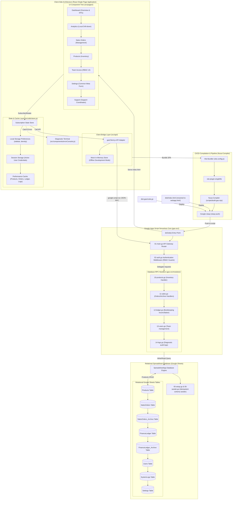

# Enterprise Multichannel ERP System
> Serverless Enterprise Resource Planning Platform Hosted on Google Apps Script and Powered by Google Sheets

[](https://vite.dev/)
[](https://react.dev/)
[](https://developers.google.com/apps-script)
[](https://www.google.com/sheets/about/)
[](https://esbuild.github.io/)
[](https://www.typescriptlang.org/)
[](LICENSE)

---

## 1. Executive Summary

This Multichannel ERP System is a serverless enterprise resource planning platform engineered to bridge B2B e-commerce operational data with high-fidelity analytical reporting. Designed for modern multi-channel merchants, the platform consolidates transaction logs, product inventories, and financial ledgers from Tokopedia, Shopee, Facebook, Instagram, and Direct Stores into a single, cohesive source of truth.

By leveraging Google Apps Script (GAS) as a serverless execution environment and Google Sheets as an idempotent relational database, the system reduces total cost of ownership (TCO) while offering high-performance, real-time analytics, modular RBAC, and system-wide diagnostic monitoring.

---

## 2. Architecture & Data Flow Diagram

The application uses an optimized compilation pipeline that bundles a React Single Page Application (SPA) into a single HTML file deployed directly onto Google Apps Script. 



### 2.1 Compilation & Deployment Workflow
1. **Frontend Compilation**: Vite compiles the React codebase. The plugin `vite-plugin-singlefile` bundles all Javascript, CSS stylesheets, and assets inline into `dist/index.html`.
2. **Backend Compilation**: The custom compiler script (`scripts/build-gas.mjs`) reads backend modules in `gas-src/` and concatenates them into `dist-gas/code.gs`, adding origin headers for diagnostic purposes.
3. **Synchronization**: Google Clasp synchronizes `dist-gas/` assets directly to the target Google Apps Script container.

---

## 3. Database Schema Specification

The Google Sheets database runs an idempotent relational schema. Each sheet represents a table with static headers enforced automatically at initialization.

### 3.1 Products Table
Defines active inventories, unit costs, and minimum thresholds.
* **Columns**: `id`, `sku`, `name`, `category`, `priceBuy`, `priceSell`, `stock`, `minStock`, `status`, `createdAt`, `updatedAt`, `createdBy`, `updatedBy`

### 3.2 SalesOrders Table
Consolidates transaction records across multi-channel integrations.
* **Columns**: `id`, `orderNumber`, `channel`, `customerName`, `totalAmount`, `paymentStatus`, `orderStatus`, `items` (JSON-string), `createdAt`, `updatedAt`, `createdBy`, `updatedBy`, `region`

### 3.3 FinanceLedger Table
Stores atomic bookkeeping logs for cash-flow ledger reconciliation.
* **Columns**: `id`, `transactionNumber`, `type` (Income/Expense), `category`, `amount`, `referenceId`, `description`, `transactionDate`, `createdAt`, `updatedAt`, `createdBy`, `updatedBy`

### 3.4 Users Table
Maintains team credentials, authorization status, and RBAC roles.
* **Columns**: `id`, `name`, `email`, `role` (Admin/Gudang/Sales/Finance/Viewer), `status`, `createdAt`, `updatedAt`, `createdBy`, `updatedBy`, `password` (SHA-256 hash)

### 3.5 Settings Table
Stores system configurations, invoice rules, metadata, and support coordinates.
* **Columns**: `id` (Primary Key), `value`, `updatedAt`, `updatedBy`

---

## 4. Platform Modules & Features

### 4.1 Executive Overview (Dashboard)
* **Real-time KPI Tracking**: Monitors Gross Merchandise Value (GMV), Total Orders, Low Stock Alerts, and Financial Balances.
* **Aspect-Ratio Optimized Sparklines**: Micro-charts display daily trajectories stretched responsively (`preserveAspectRatio="none"`) across all grids.
* **Granular Time-Scale Controls**: Toggles display scale (D/W/M/Q) locally without affecting adjacent widgets.

### 4.2 Local Drill-Down Analytics
* **Flexible Granularity**: Allows scaling analysis by Day (D), Week (W), Month (M), or Quarter (Q).
* **Multi-channel Revenue Share**: Interactively maps revenue contribution percentages with integrated ASC and DESC sorting toggles.
* **Bento Performance Indicators**: Automatically displays highest-performing channel, Average Order Value (AOV), and total orders in balanced info containers.

### 4.3 RBAC Security & Management
* **Role-Based Permissions**: Restricts or grants page accesses automatically based on roles:
  * **Admin**: Unrestricted read/write access to all settings, users, databases, and logs.
  * **Viewer/Gudang/Sales/Finance**: Scoped views matching functional operational responsibilities.

### 4.4 Diagnostic Console
* **Runtime Diagnostic Log**: Renders systemic background warnings and exception traces directly inside an integrated terminal UI.
* **Verification & Audit**: Logs administrative changes, data seeds, and transaction states automatically in the `SystemLogs` table.

---

## 5. Development & Deployment Guide

### 5.1 Local Development Environment
Ensure you have Node.js 18+ installed on your workspace.

1. **Install Dependencies**:
   ```bash
   npm install
   ```
2. **Start Vite Dev Server**:
   ```bash
   npm run dev
   ```
   *Runs local React environment with mock data bindings inside `src/api/gasClient.js`.*

### 5.2 Build & Bundle
Compile the client SPA and backend scripts into Google-compliant assets:
```bash
npm run build:all
```
This script compiles:
* `dist/index.html` (single-file output)
* `dist-gas/code.gs` (concatenated GAS backend code)
* Copies setup & seeder files to `dist-gas/`

### 5.3 Pushing to Google Apps Script
Ensure `@google/clasp` is authorized and bound to your target Google Spreadsheet script.

1. **Login to Google Account**:
   ```bash
   npx clasp login
   ```
2. **Synchronize Code**:
   ```bash
   npx clasp push -f
   ```

---

## 6. Installation & Database Seeding

After pushing the compiled assets to your script editor:
1. Open the linked Google Spreadsheet.
2. Select **Extensions** > **Apps Script**.
3. Select and execute the function **`runSetup()`** in `setup.gs` to create the database schemas and initialize default settings.
4. Select and execute the function **`runSeeder()`** in `seeder.gs` to populate the sheets with standard mock transaction data for analytics simulation.
5. Select **Deploy** > **New deployment** > **Web App** to serve the application link to users.

---
*Worksense Systems. Engineered for scalable multi-channel operational workflows.*
